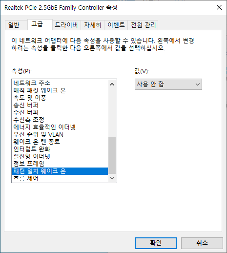

# WakeOnLan
be on test

```
fmt.Println("on test")
```

Go : 1.15

Python : 3.8

## See also
이미 무료 프로그램이 있으니 같이 사용 하여 테스트 하시길.

https://sourceforge.net/projects/aquilawol/


## Packet

대상 PC MAC address (ex) : 34-F2-22-12-12-12
                      
0xFF 0xFF 0xFF 0xFF 0xFF 0xFF 

0x34 0xF2 0x22 0x12 0x12 0x12       : 16 번 반복

총 102byte UDP broadcast 전송.

[255 255 255 255 255 255 52 242 34 18 18 18 52 242 34 18 18 18 52 242 34 18 18 18 52 242 34 18 18 18 52 242 34 18 18 18 52 242 34 18 18 18 52 242 34 18 18 18 52 242 34 18 18 18 52 242 34 18 18 18 52 242 34 18 18 18 52 242 34 18 18 18 52 242 34 18 18 18 52 242 34 18 18 18 52 242 34 18 18 18 52 242 34 18 18 18 52 242 34 18 18 18]

## Network 설정
BIOS 설정 변경 필요.

BIOS 항목중에 Wake 관련 된 것들을 enable 시켜 줄것. 요리 조리 둘러보면 있음(-.-!)

네트워크는 설정은 Driver 가 윈도우 기본 으로 설치된경우 안보일수 있다.

고로 해당 제조사에서 다운 받아 다시 설치 할 것.




## Issue
해보니 패킷 한번 전송으로 안 될때가 많다.

시점의 문제인지 알 수 가 없다.

몇번 반복하다 보면 된다.

많이 보낸다고 되는건 아니다.
