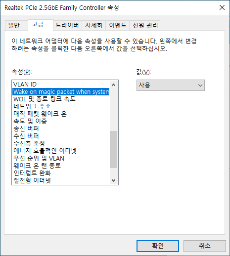
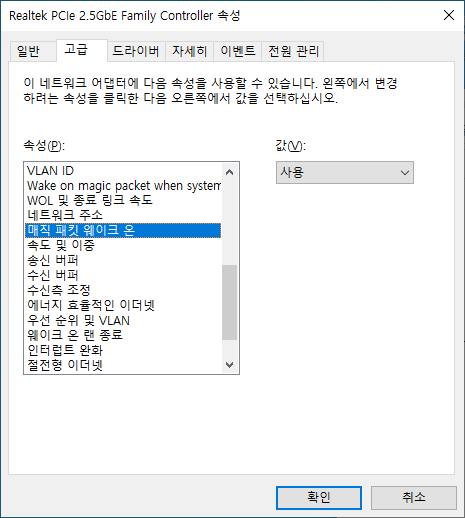
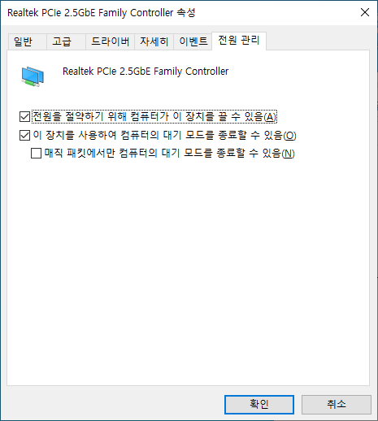

# WakeOnLan

## Packet

대상 PC MAC address : 34-F2-22-12-12-12
                      
0xFF 0xFF 0xFF 0xFF 0xFF 0xFF 

0x34 0xF2 0x22 0x12 0x12 0x12       : 16 번 반복

총 102byte UDP broadcast 전송.

## Network 설정
BIOS 설정 변경 필요.

네트워크는 설정은 Driver 가 윈도우 기본 으로 설치된경우 안보일수 있다.

고로 해당 제조사에서 다운 받아 다시 설치 할 것.

## Issue
해보니 패킷 한번 전송으로 안 될때가 많다.

시점의 문제인지 알 수 가 없다.

몇번 반복하다 보면 된다.

많이 보낸다고 되는건 아니다.
